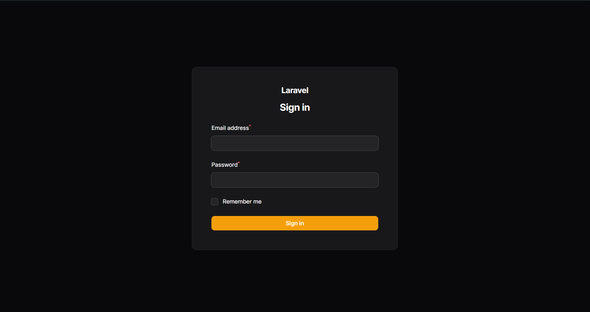
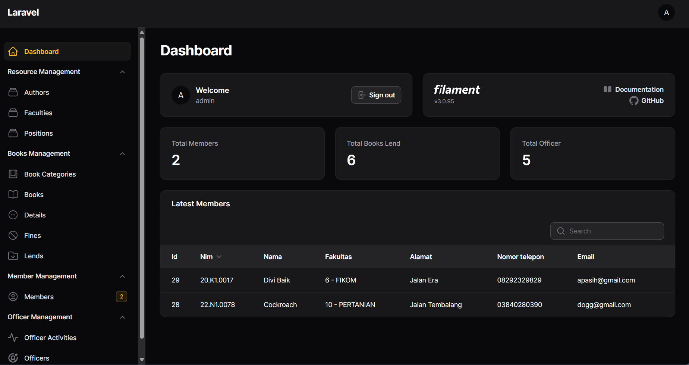

# Vivid Library

This is a CRUD book management application built using Laravel, Filament, and Filament-Excel.

## Getting Started
To get started with the application, you need to follow these steps:

1. Clone the repository.
   
    ```bash
    git clone https://github.com/thisdoraemon/vivid.git
    ```

2. Start the development server.

   ```bash
    php artisan serve
   ```

3. Visit `http://localhost:8000/admin/login` in your browser.
4. Log in with the following credentials:

    - **Email: admin@admin.com**
    - **Password: admin**
  
**Note:** This project is my first-time result of learning Laravel and Filament, 
and it may be subject to further improvements. Feel free to import the provided `perpustakaan.sql` file into your local database and play around with it.

## Features

The application provides the following features:

- CRUD operations for books
- Book listing with search, sort, and pagination capabilities
- Export book data to Excel

## Technology Stack

The application uses the following technology stack:

1. Backend: Laravel
2. Admin Panel: Filament
3. Excel Integration: Filament-Excel
   
## License
This project is licensed under the [MIT License](https://github.com/thisdoraemon/vivid/blob/main/LICENSE).

## Screenshots
Here are some screenshots of the application:




